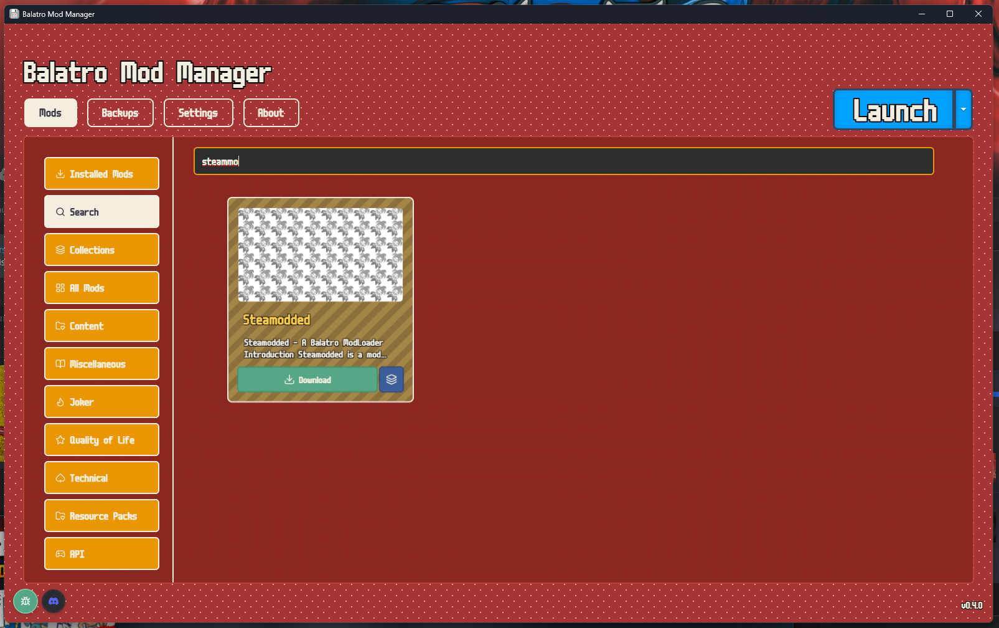
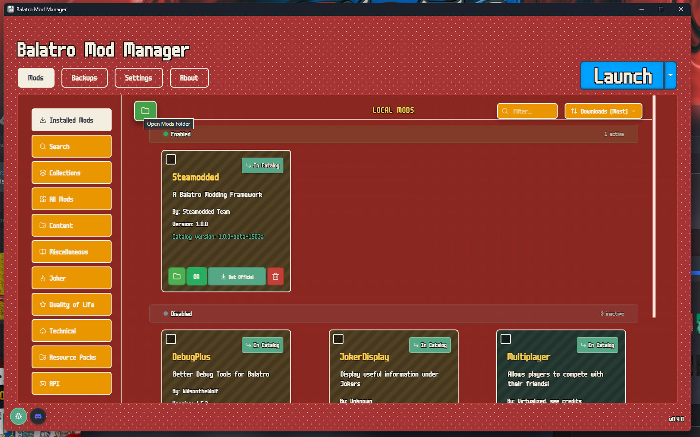
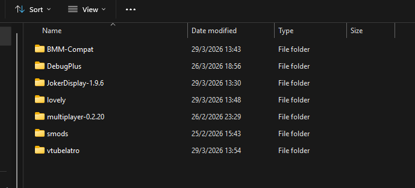
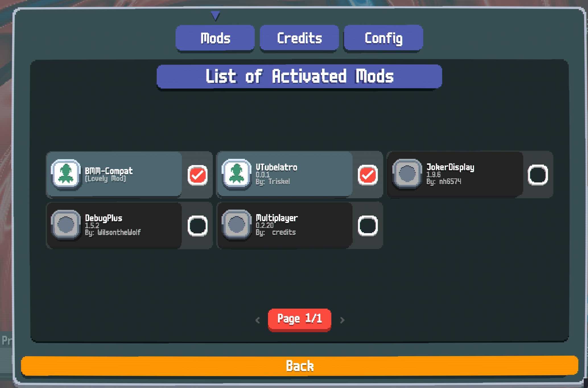

# Installation Guide

## Requirements

- [Balatro](https://store.steampowered.com/app/2379780/Balatro/)
- [Balatro Mod Manager](https://balatro-mod-manager.dasguney.com/download)
- [VTubelatro](https://github.com/triskelvt/vtubelatro-public/releases/tag/release)

## Steps

### 1. Install Balatro Mod Manager

Download and install [Balatro Mod Manager](https://balatro-mod-manager.dasguney.com/download).

### 2. Install Steamodded

Open Balatro Mod Manager, search for **Steamodded**, and install it.

### 3. Open the Mods Folder

In Balatro Mod Manager, click on **Installed Mods**, then click **Open Mods Folder**.

### 4. Place VTubelatro

Download [VTubelatro](https://github.com/triskelvt/vtubelatro-public/releases/tag/release) (.zip) and extract its content into the mods folder that was opened in the previous step.

### 5. Verify Installation

Launch Balatro and click the **Mods** button on the main menu. You should see VTubelatro listed there.

